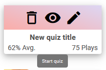
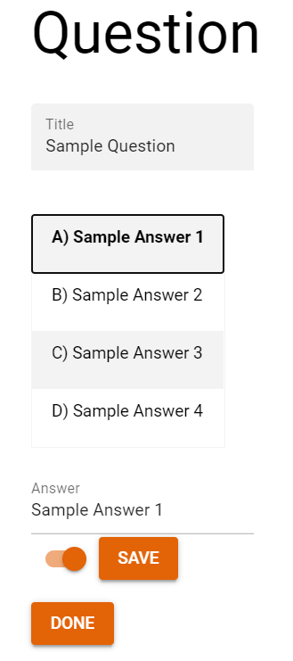
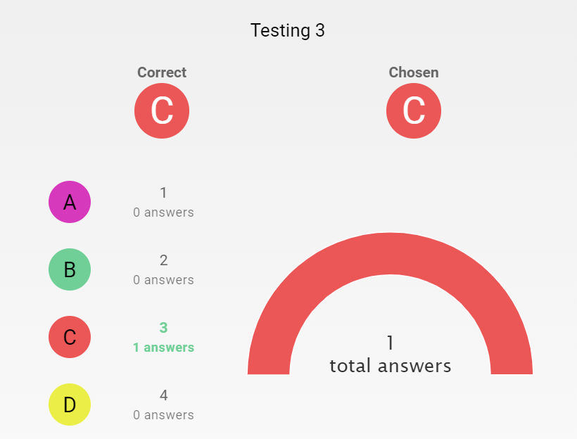

# Quizzion (quizzion)

A game-like quiz application.

# Setup

## Install the dependencies and start the frontend in development mode (hot-code reloading, error reporting, etc.)
```bash
cd quizzion
npm ci
quasar dev
```

### Lint the files
```bash
yarn run lint
```

### Build the app for production
```bash
cd quizzion
quasar build
```

### Customize the configuration
See [Configuring quasar.conf.js](https://quasar.dev/quasar-cli/quasar-conf-js).

## Install the dependencies and start socket server 
```bash
cd socketserver
npm ci
npm run start
``` 

# App Flow

## Homepage 

This is the first thing when user access Quizzion website, if they have invitation code, they can put it in this input field to join the quiz


If the invite code is wrong they will receive this message


If the invite code is right, they will be asked for name they wanted to use in the quiz, name must be logger than 1 character


## Login 


This is the sign in page. It is accessible from the sign in button in the header. Here you can enter your username and password to log in to Quizzion 2.0. The sign in button is disabled until the requirements for the username and password are met. There is a button to show your entered password so you can check if you made a typo. 

## Header

The are two versions of the header, one for if you are not logged in and one for when you are logged in.


When you are not logged in there is a button that will bring you to the invite page, where you can enter a invite code and participate in a quiz. The other button will bring you to the sign in page where you can use your Quizzion 2.0 account to log in and create or host quizzes. 


The header when you are logged in has three buttons, dashboard will bring you to the dashboard page with all you quizzes, profile will take you to the profile page with your user info and log out will just log you out and bring you back to the sign in page.

The header will change depending on the size of the screen, so it is still usable on mobile devices.


## Dashboard

After a successful login, user will be redirected to the Dashboard page where all quiz is displayed. There are two variations of quiz tile, one with a thumbnail and one without


When hover, 3 icons will appear which are delete quiz, view statistic and edit quiz, these 3 icons will always appear when user is using mobile


On the left side bar user can sort quiz based on play times and average pass of the quiz, the default sort display the newest created quiz


On the sub-header of Dashboard page, logged in user also can participate in a quiz, this input field act the same as the one in Join page, after put in the invite code, user can press enter or click on the arrow button


To start a quiz, simply click on the white part of the quiz tile



## Profile

In profile page, user can see 4 informations about the account: username, first name, last name and email


After pressing the Edit button, 3 input field will appear, username cannot be edited, no number is allowed in all 3 fields


After click `Submit` button, the success notification will appeear


## Waiting Room / Join

The waiting room is displayed before a quiz starts to collect all participants and start a quiz when everyone is ready. Besides that participants can send and receive messages using a chat interface. 

The waiting room has two designs - one is displayed for moderator and another for guest user.

### Moderator screen:


### Moderator chat interface:


### Guest user screen:


### Guest user chat interface:


### Functionality

Behind the scenes the waiting room pre-fetches the questions for the quiz and shares them through the server with the participants. The moderator also has the ability to start the quiz or stop it. When the start button is pressed all participants are redirected to the participation page. While participants are waiting they can use the chat to send and receive messages the transaction of which is going through the socket server.

On the top-right corner in the moderator page an invitation code is displayed which can be used for inviting participants.

## Editor

On this page you can create a quiz. We will tell you how you can create a quiz in the quiz editor. Once on this page you will see an editor on the right and question cards, if added, on the left.


### Main quiz data
In quizzion the user is able to add a quiz and customize it. For example: A user can either add a theme or a thumbnail, or both!. The user is also able to set a time limit for the quiz. Once enter the Quiz Editor you will see the general editor on the right, here you can fill in some general data, once done you can click on *save*. This will now save and store the quiz.

*NOTE: * If you the editor already loaded a selected quiz from the dashboard it will just edit the quiz and not add a new one


### Add a question
To add a question we go and look to the left of the editor, here we see a green button with a white plus, click this to add a question. This will add a question card.


### Edit a question
To edit a question you click on the edit icon on the question card, this will open the question editor. Here you can fill in data for the question, like a title or answers. once done click on *done* and the question will be saved.




### Add answers to a question
To add an answer click on the answer input field and type something. Once done you can either toggle the slider or not, this will determine whether the answer is correct or not. You can have multiple correct answers. Once done click on save! you can only add 4 answers max.

### Remove a question.
To remove a question simply click the trash icon and it will be removed from the list.

### Reorder questions
In order to reorder the questions just drag the questions around in the list and let go. This will reorder the questions

### Reorder answers
In order to reorder the answers just drag the answers around in the list and let go. This will reorder the answers

*NOTE: * If you edit an existing question it will load data from that exisitng question.


## Quiz Completion / Charts / Leaderboards

The completion page consists of 3 main states.

Upon the moderator starting the quiz from the waiting room all users are forwarded to the first question of the quiz. They can also see a mini header containing the Title, a progress bar tracking how much they have left, and a timer upon the end of which they are automatically forced to complete the quiz, leaving all questions not reached with blank answers. 


After the question answer has been sumbitted the users can see a chart containing data on all the users' answers and some extra information about whether or not they chose the right answer. They can also see a part of the leaderboard displayed in the end only highlighting the top 3 users.


Upon answering all the questions of the quiz the users are shown all the user scores and can see how they rank compared to the other participants. 
