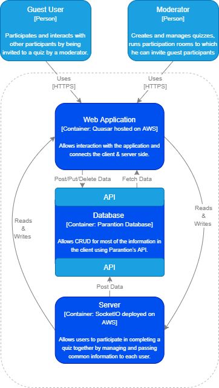
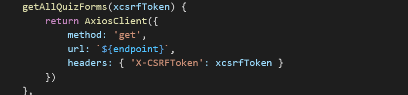
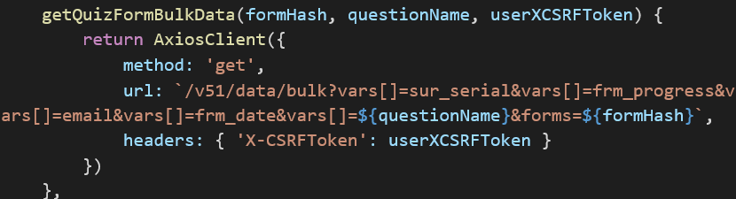
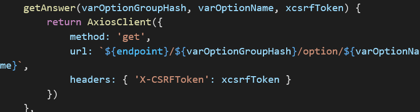

# Project HBO-IT Corp

## Team 6.2

**Students:** Berend (462753), Dylan (462777), Huy (463726), Tadas (426589), Kaloyan (467364)

**Academy:** ACT

**Course:** Project HBO-IT Corp.

**Teachers:** Paul de Groot

**Date:** 29/06/2020

# Table of contents

## [Chapter 1: Plan of Approach](#plan-of-approach) Kai

### [1.1 Introduction](#introduction)

#### [1.1.1 Why](#why)

#### [1.1.2 What](#what)

#### [1.1.3 Who](#who)

#### [1.1.4 When](#when)

### [1.2 Management](#management)

#### [1.2.1 Scope Management](#scope-management)

#### [1.2.2 Schedule Management](#schedule-management)

#### [1.2.3 Quality Management](#quality-management)

#### [1.2.4 Resource Management](#recourse-management)

#### [1.2.5 Stakeholder Management](#stakeholder-management)

#### [1.2.6 Communication Management](#communication-management)

#### [1.2.7 Change Management](#change-management)

#### [1.2.8 Risk Management](#risk-management)

### [1.3 Competences](#competences)

## [Chapter 2: Functional Design](#functional-design)

### [2.1 Requirements](#requirements) Kai

### [2.2 Tooling](#tooling) Tadas

### [2.3 Design Choices](#design-choices) Kai

## [Chapter 3: Technical Design](#technical-design)

### [3.1 Architecture](#architecture) All of us (Kai will prepare the file in lucid chart and we will do it in a meeting)

### [3.2 Structure](#structure) Dylan

### [3.3 API](#api) Berend

#### [3.3.1 API usage](#api-usage)

##### [3.3.1.1 AxiosClient](#axios-client)

##### [3.3.1.2 AuthInterceptor](#auth-interceptor)

##### [3.3.1.3 User](#user)

###### [3.3.1.3.1 Authenticator](#authenticator)

###### [3.3.1.3.2 UserRepository](#user-repository)

##### [3.3.1.4 Quiz](#quiz)

###### [3.3.1.4.1 QuizFormRepository](#quiz-form-repository)

##### [3.3.1.5 QuestionRepository](#question-repository)

##### [3.3.1.6 QuestionFetcher](#question-fetcher)

##### [3.3.1.7 AnswerRepository](#answer-repository)

##### [3.3.1.8 QuizTemplateRepository](#quiz-template-repository)

##### [3.3.1.9 Files](#files)

###### [3.3.1.9.1 FileRepository](#file-repository)

#### [3.3.2 Conclusion](#conclusion)

### [3.4 Server](#server) Tadas

### [3.5 AWS](#aws) Huy & Dylan

#### [3.5.1 Hosting](#hosting)

#### [3.5.2 Deployment](#deployment)

## [Chapter 4: Test rapports](#test-rapports) Kai

## [Chapter 5: Recommendations](#recommendations) For sure Dylan with AWS deployment and Berend for files + anything more from the rest

## [Chapter 6: Scrum](#scrum) Kai

### [6.1 Sprint 0](#sprint-0)

### [6.2 Sprint 1](#sprint-1)

### [6.3 Sprint 2](#sprint-2)

### [6.4 Sprint 3](#sprint-3)


<div id='plan-of-approach'/>

# Chapter 1: Plan of Approach

<div id='introduction'>

## 1.1 Introduction
Parantion has an existing platform called Easion, this platform gives insight about quizzes and surveys to the clients. For the quiz module they have developed a module called Quizzion, Quizzion is a platform that provides the user with the ability to host quizzes like pub and/or educational quizzes, with Quizzion the customer can easily create their own dynamic quizzes and get easy and clear insights of the quiz results. 

<div id='why'>

### 1.1.1 Why
What is the problem or value proposition addressed by the project? 

Provide a fully customizable and distributable survey which is protected from any outside altercations. 

<div id='what'>

### 1.1.2 What
What is the work that will be performed on the project? 
- Create an application following the original Quizzion application and building up on it in regards to the updated Easion version.  
- Create a thorough documentation about our development process and design behind the application. 
- Keep a timetable of all our work put into the project 
- Create an interactive and scalable design for the application 
- Connect the backend with our design implementing the Easion API 

What are the major products/deliverables? 
- Documentation 
- Frontend 
- Backend 

<div id='who'>

### 1.1.3 Who
Who will be involved and what will be their responsibilities within the project? 
- Huy - full-stack 
- Dylan - full-stack 
- Berend -  full-stack 
- Tadas -  full-stack 
- Kaloyan -  full-stack, responsible for project management 


How will they be organized? 

We will be keeping communication through our Microsoft Teams and WhatsApp groups. Our organization will be synced with our issues in GitLab and our time spent working on the project will be transferred to our Timesheet in Microsoft Teams. 

<div id='when'>

### 1.1.4 When

What is the project timeline and when will particularly meaningful points, referred to as milestones, be complete? 
- Weeks 1-2: Documentation and Research Phase – we'll work on our plan of approach and functional/technical documentations, do some research on the new technologies that we'll use and study the existing Easion and Quizzion applications for reference 
- Weeks 3-4: Realization of minimal viable product 
- Weeks 5-6: Realization of additional features 
- Weeks 7-8: Polishing and testing project and finalizing documentation 

<div id='management'/>

## 1.2 Management
Here we will cover the main parts that went into our work management plan.

<div id='scope-management'/>

### 1.2.1 Scope Management

In this topic we will talk about and define the scope of the entire project and the product itself. We will give you an idea of which processes and tasks will be involved with the project and product. The project scope will be bigger than the product scope since the product is basically like a module of the project scope. 
 
#### Project 
To be able to work on the project efficiently we need to know a bit more about the scope of the project, which tasks will be involved with working on this project. The first task is already very clear, this is communication. We are making this project for a real client and we also work in a team. It is really important to keep up to date with the team members as well as with the client itself. 
 
The reason why communication with the client is so important is also the reason why it's in the scope, the client has a set of requirements which we specifically have to follow in order to finish the project correctly and deliver a reasonable product. If we don't communicate adequate enough with the client we might miss out on some vital requirements and we also might end up with a wrong and different product as the product they wished for and expected. And if needed, we could also suggest some changes or features for the final product to the client. Also once the build phase in the product scope has started it is also very important to keep track of each member's work to prevent possible issues along the way, like double work or poorly implemented components. 
 
We also have to maintain a version control repository for the product with other possible documents such as code documentation and technical diagrams, so basically a document for technical documentation. The maintenance of the version control is very important since the client will be using our application in the future and they need clear insight into the application's inner workings and also need to be able to work with it as fast as possible. 
 
In this project we also have to do administrative functions such as maintaining a time schedule and keeping track of work which has been done by the members of this project. This is very important information as it will be used as an indication of how hard and how good we have worked on this project. This will be taken into account with the final grading and maybe by the client as well. 
 
#### Product 
Besides communication there is also work to be done. The work for the project contains design and implementation, which falls under the realization of the project, the result of which will be the final product which we are going to deliver. The product we are going to deliver is a web application. 
 
A web application comes with a lot of things, most of the times including an API with a database. In our case it will also include an API and database but this is not within our scope, since they want us to specifically create a web application and not a full-stack system. We will be provided with an API and database. We will only have to focus on the Quasar and VueX framework with the implementation of a socket server. Now that we have this clear we can talk about the design phase, which is in the product scope as well. 
 
The design phase for the product will include creating a visual layout for the front-end and coming up with possible class diagrams. The design phase is very important, with this phase we can show the client what they can expect and receive possible feedback. If we receive good and useful feedback from the client we can still make final touches and tweak it till they are satisfied. After the design phase we can use the information, design and diagrams in our implementation process. The usage of the information from the design phase will make the implementation much easier and faster. So this is why the design phase is a very important phase within the product scope. 
 
After the design phase, as mentioned above, we will move to the implementation phase. This phase is quite possibly the most important and biggest part of the entire scope (project and product scope both included). Here usage of information from the design phase and communication is very important. If we do the design and communication correctly we will have a higher change of delivering a final and fully working product with all requirements and good design to the client. This phase will be the deciding and final phase of the product scope,  the end of the product scope will also signal the end of the project scope. 

<div id="schedule-management">

### 1.2.2 Schedule Management

The tasks that need to be complete to successfully deliver the project will be decided upon by the team and Parantion. All the tasks in the project will be given an estimated time it will take to realize them. Several times a week there will be meetings about how the tasks are progressing. The time that is spent working on the tasks of the project will be kept in the timesheet in Teams. During the project there will almost certainly be changes made to the schedule be it because a task is taking more time than expected or because we need to shift priorities, this will be discussed with the necessary people and solved to the best of our abilities. 

<div id="quality-management">

### 1.2.3 Quality Management

Quality control is done by testing all the finished user stories and designs. Acceptance criteria is covered in the test rapports. 
Where possible components will be tested using unit tests to ensure logic works as intended. 
When working on front end each page will be checked if it matches designs. We will do so in pull requests. 

<div id="recourse-management">

### 1.2.4 Resource Management

Our main resource during the project will be our time to develop. Officially we all have an estimation of around 32 hours per week in which we are to be working on the project. A part of that time will be dedicated to our weekly University meetings but the majority will be dictated by us. We can already outline how our time will be spent with our user stories and considering the main goals we have outlined we can give an estimation of the time we will spend on each major part of the project (Documentation, Design, Code) which we can reaffirm with frequent timesheet references. 

<div id="stakeholder-management">

### 1.2.5 Stakeholder Management

| **Stakeholder** | **Position** | **In/External** | **Influence** | **Interest** | **Priority** | **Contacts** |
| --- | --- | --- | --- | --- | --- | --- |
| Team A6-2 | Developer | External | 2 | Experience | Develop great quality product | |
| Parantion | Owner | External | 1 | Business | Provide detailed information about product | Nick Henzen +31 (0) 570 23 45 67 |
| Saxion | Controller | External | 3 | Education | Guide developers during the project | |

<div id="communication-management">

### 1.2.6 Communication Management

Communication between team members such as team meetings and work assignments happens via WhatsApp and Microsoft Teams. During the meeting team members will decide when will the next meeting be and write the date and time in the WhatsApp group to remind others. 

<div id="change-management">

### 1.2.7 Change Management

If it is found necessary to make major changes during the course of the project, what needs to be changed and the best way how will be discussed within the team and with the shareholders. These changes can be for instance - change in the timeline of the project, certain functionality not being able to be implemented or changed in a major way, design overhauls, etc. The team and the shareholders will come to an agreement about what the best way forward is. The changes will then be implemented. The changes that are made will be logged with an explanation about why the changes where necessary. Minor changes during development are to be expected and discussed within the team, but if they have little or no impact for the final product, will just be implemented. 

<div id="risk-management">

### 1.2.8 Risk Management

For any project, unexpected things tend to happen. For example, a team member unable to deliver the promised job in time or one's function conflict with other team member's functions. 

To Remedy this, all team members are required to report their work progress in the WhatsApp group chat every workday and to reduce the function conflicts. 
 
If one is working on a function which closely interacts/depends with another member's function then they are required to work together via Microsoft Teams. 
 
If any of the team members have an emergency like illness or family matters, they are required to notify other team members in advance and if it is serious they have to notify the teacher as well. 

<div id='competences'/>

## 1.3 Competences

Going over our flexible competences which are supposed to sum up to 60% of our overall project weight:

| **Competence** | **Description** | **Weight** | **Reasoning** |
| ------------ | --------------- | --------------- | --------------- |
| Analysis | Ability to analyse the context and problem statement (of the company), to be able to properly formulate the objective(s) and scope of the assignment. This includes the ability to properly define requirements and being able to verify whether these requirements are satisfied. | 15% | Throughout the project we kept a constant stream of communication internally in the team and externally with our study coordinator and the company's representative. This helped us keep on top of our analysis and feedback foundation and following updates. |
| Design | Ability to design an (information based) system which can be considered a solution to the problem statement, meeting some predefined requirements. Ability to express the design by means of techniques as taught within the different courses. | 10% | We had a clear foundation of the design at the beginning of development. As the development progressed some additional features were added but without the backing of mockups they went through several iterations. |
| Realisation | Ablility to, based on a design, realise a solution that resolves a given problem and verify the success of the solution. | 20% | We realised the application with the base functionalities and added some additional ones on top without using anything other than their API to communicate with their database. |
| Advise | Ability to provide an advise for the long-term development (or implementation) of the solution. | 5% | We were focused on development of the project in the scope of our 3 sprints and didn't spend that much effort advising and compiling future possible developments even though we still have some parts included as recommendations. |
| Manage & Control | Ability to implement techniques and proceses that contribute to the development (and maintenance) of a solution. | 10% | Our task management was consistent, shown through our GitLab workflow and issues, but we didn't integrate any tests. |


<div id='functional-design'/>

# Chapter 2: Functional Design

<div id='requirements'/>

## 2.1 Requirements

We have outlined the following main requirements for the final product deliverable:

| **Req. No.** | **Description** |
| ------------ | --------------- |
| RQ_1 | User can create a custom quiz with a game like element |
| RQ_1_1 | User can use a dashboard to edit the quiz |
| RQ_1_1_1 | User can add a time constraint the quiz |
| RQ_1_1_2 | User can change the design of the quiz |
| RQ_1_1_2_1 | User can choose from a set of predefined themes to apply to the quiz |
| RQ_1_1_2_2 | User can change the quiz thumbnail |
| RQ_1_1_3 | User can add a title to their quiz |
| RQ_1_2 | User can have a preview of the created quiz |
| RQ_1_3 | User can add new questions to the quiz |
| RQ_1_4 | User can edit question title |
| RQ_1_5 | User can edit question description |
| RQ_1_6 | User can edit question answers |
| RQ_1_7 | User can edit the correct/incorrect answers |
| RQ_1_8 | User can delete question |
| RQ_1_9 | User can reorder questions |
| RQ_2 | User can see the results for a quiz on a page |
| RQ_2_1 | User can see how the other users answered the last question after they completed it while doing a quiz |
| RQ_2_2 | User can see the people who answered the last question the fastest while doing a quiz |
| RQ_2_4 | User can see an overview of a question's answers |
| RQ_2_5 | User can see if their answer on the last question of the quiz was correct and if not which one was |
| RQ_3 | User can invite other users to do their quiz through an invitation link |
| RQ_4 | User can do the quiz on any device |
| RQ_4_1 | User can do the quiz on PC |
| RQ_4_2 | User can do the quiz on mobile |
| RQ_4_3 | User can do the quiz on tablet |
| RQ_5 | User can see and manage an overview of their quizzes |
| RQ_5_1 | User can preview their already created quizzes |
| RQ_5_2 | User can edit their already created quizzes |
| RQ_5_3 | User can delete their already created quizzes |
| RQ_6 | User can fill in quizzes in real-time with other people |
| RQ_7 | User has a profile page in which they can put information |
| RQ_8 | User can live chat with other users |

<div id='tooling'/>

## 2.2 Tooling

### Quasar (https://quasar.dev/) 
```
Quasar is an open-source Vue.js based framework, which allows you to quickly create responsive websites/apps.  


Where are we using it? 

We will use it for common components like buttons, tables, page layouts as well for styling our application. 

Documentation (https://quasar.dev/quasar-cli/installation) 
```
 

### Vue.js (https://vuejs.org/) 

```
Vue.js is a progressive framework for building user interfaces. The core library is focused on the view layer only, and is easy to pick up and integrate with other libraries or existing projects. 


Where are we using it? 

All view layers will be built using vue.js components. 


Documentation (https://vuejs.org/v2/guide/installation.html) 
```
 

### Vuex (https://vuex.vuejs.org/) 

``` 
Vuex is a state management pattern + library for Vue.js applications. It serves as a centralized store for all the components in an application, with rules ensuring that the state can only be mutated in a predictable fashion. 

 
Where are we using it? 

We will use vuex to manage application state. 
 

Documentation (https://vuex.vuejs.org/installation.html) 
```

### Socket.io-client (https://socket.io/docs/client-api/)

```
Socket.IO is a library that enables real-time, bidirectional and event-based communication between the browser and the server.

Where are we using it?

Socket.io will be used for real-time communication between client and server.

Documentation (https://socket.io/docs/client-api/)
```

### Highcharts (https://www.highcharts.com/)

```
Highcharts is a modern SVG-based, multi-platform charting library.


Where are we using it?

Highcharts will be used for displaying chart between quiz questions and sumary of the game.

Documentation (https://www.highcharts.com/docs/getting-started/installation)
```

### Axios (https://github.com/axios/axios)

```
Axios is promise based HTTP client for the browser and node.js

Where are we using it?

Axios is used in application, server backend to make HTTP requests to the API


Documentation (https://github.com/axios/axios#installing)
```

### Chai (https://github.com/axios/axios#installing)

```
Chai is an assertion library, similar to Node's built-in assert. It makes testing much easier by giving you lots of assertions you can run against your code.

Where are we using it?

Chai is used in unit tests as it gives a lot of helper functions


Documentation (https://github.com/axios/axios#installing)
```

### adorable-avatars (http://avatars.adorable.io/)

```
Adorable avatars is an avatar placeholder service for web, developers and designers.

Where are we using it?

Adorbable avatars will be used for generating unique avatars.


Documentation (https://github.com/adorableio/avatars-api-middleware)
```

### express (http://expressjs.com/)

```
Express is fast, unopinionated, minimalist web framework for nodeJS.

Where are we using it?

Express mainly will be used to initialize socket server.


Documentation (https://github.com/expressjs/express)
```

### socket.io (https://socket.io/)

```
Socket.IO is a library that enables real-time, bidirectional and event-based communication between the browser and the server.

Where are we using it?

Socket.io will be used for real-time communication between client and server.


Documentation (https://socket.io/docs/server-installation/)
```

### Mocha (https://mochajs.org/)

```
Mocha is a feature-rich JavaScript test framework running on Node.js and in the browser, making asynchronous testing simple.

Where are we using it?

Mocha will be used for asynchronious testing.


Documentation (https://mochajs.org/)
```

### Eslint (https://eslint.org/)

```
ESLint is an open source JavaScript linting utility

Where are we using it?

For anlyzing our code to find problematic patterns or code that doesn't adhere to certain style guides.


Documentation (https://eslint.org/docs/user-guide/getting-started)
```

<div id='design-choices'/>

## 2.3 Design Choices

We wanted to achieve a simple yet efficient feel of the application for both participants and moderators. Thus we wanted to have a lot of visual clarity with colors and icon buttons signalling actions instead of text descriptions.
The easiest way to showcase our initial design choices would be to go over our initial mockups.

Starting from the join page which is the first page that a user sees upon entering the application. We decided to keep it as minimal as possible making it very clear what the user is expected to do in it. Since it is the first page it also makes the process of joining a quiz as fast as possible for a potential participant.

Initially we though that everyone could register and create quizzes which is reflected in our initial mockups for pages like the sign up/in (below) and others like the profile and dashboard. Although the sign up panel has been cut out and replaced by an account application link, the design and feel of the page remain the same.


After a moderator logs in we wanted to show them a control hub in which they can control as much as possible while it being compact and maneuverable from first glance. This page remained mostly the same in our final version with some additions like the drawer menu with quiz sorting and the moved quiz creation button.

From the dashboard we can take a couple of different routes. Going over the quiz related routes first we have the quiz editor and creator page which ended up also staying mostly unchanged from our original iteration - we got a big part of the idea for this page from Easion's version of a similar functionality. Something we had a fair level of difficulty was putting all the functionality we wanted for the quiz editting and creation in a single page without it seeming cluttered.


Considering the self explanatory nature of the deletion and edit routes we can skip to the profile and quiz overview.

The profile is something which we originally intented to be much more than it was in the final version but not due to technical limiations but vision clashes. We wanted to implement a lot of statistical data and achievement-like parts to the profile page to enforce the game-like element we were going for. We ended up scrapping this idea upon considering it together with Parantion and seeing some flaws in how it fits with their image of the application.

The overview page was a way for the moderator to go through his quiz one question at a time while also seeing the total participation data that has been gathered on it.


The last part of the application is the quiz completion route which consists of a waiting room which the users get forwarded to upon joining which we considered in the beginning but ended up redesigning later on and the actual question answering part which has 3 states - question answering, viewing of all answers and top 3 users as of that point in the quiz completion and finally the complete leaderboard of all participants. The main additions to our base idea were the implementation of a chat in the waiting room to keep the users engaged while they were completing the quiz and some playful randomly-assigned avatars which users got upon entering the waiting room.


<div id='technical-design'/>

# Chapter 3: Technical Design

<div id='architecture'/>

## 3.1 Architecture



<div id='structure'/>

## 3.2 Structure

_goes over the structure of our project - components, pages, methods, and so on - supposed to ease the user into the way we're functionaly doing things_

```shell
+---docs                                           #folder for documentation
|   |   documentation.md                           #main documentation
|   |
|   \---images                                     #folder for images for use in the documentation
+---keys                                           #folder for the keys to ssh into the AWS EC2
|       quizzion_socket_server.pem
|       quizzion_socket_server.ppk
|
+---quizzion                                       #folder for the front-end part of the Quizzion 2.0 app
|   |   quasar.conf.js                             #main quasar config file
|   |
|   \---src                                        #src folder for Quasar
|       |   App.vue
|       |   index.template.html
|       |
|       +---assets                                 #images used in the app
|       |       bg.jpg
|       |       quasar-logo-full.svg
|       |       sad.svg
|       |
|       +---boot
|       |       axios.js
|       |
|       +---components                             #reusable quasar components
|       |   |   Chat.vue                           #component for chat during quizzes
|       |   |   CompletionCard.vue                 #component for showing the statistics of a completed quiz
|       |   |   CompletionQuestionCard.vue         #component show how a question was answered
|       |   |   EditorGeneralBar.vue               #edit component for quiz
|       |   |   EditorQuestionBar.vue              #edit component for questions
|       |   |   EssentialLink.vue                  #do we use this?
|       |   |   InvitationCodeInput.vue            #component for entering an invite code to join a quiz
|       |   |   ProfileSkeleton.vue                #component for the profile page
|       |   |   QuestionCard.vue                   #card component for answering questions
|       |   |   QuizHeader.vue                     #quiz header component
|       |   |   StatisticOverviewCard.vue          #component for displaying the quiz statistics
|       |   |   SubHeader.vue                      #sub-header component for the dashboard
|       |   |
|       |   +---charts                             #the chart components used for quiz statistics
|       |   |       DoughnutChart.vue
|       |   |       LeaderboardComponent.vue
|       |   |       MiniLeaderboardComponent.vue
|       |   |
|       |   +---dashboard                          #components for showing an users created quizzes on the dashboard
|       |   |       CreatedQuiz.vue
|       |   |       CreatedQuizSkeleton.vue
|       |   |
|       |   +---helpers                            #helper components - only has error display
|       |   |       Error.vue
|       |   |
|       |   \---waitingroom
|       |           InvitationView.vue             #view for displaying invitation code
|       |           UserCard.vue                   #display the quiz takers avatar/name
|       |           WaitingQuizCard.vue            #waitingRoom component
|       |
|       +---css                                    #fonts and some css styling for the app
|       |   |   app.scss
|       |   |   quasar.variables.scss
|       |   |
|       |   \---fonts
|       |           Righteous-Regular.ttf
|       |
|       +---layouts                                #main layout to be used on every page
|       |       MainHeader.vue                     #header layout
|       |       MainLayout.vue                     #default quasar layout, not used
|       |
|       +---pages                                  #all the pages for the app
|       |       ChartPage.vue                      #test, not used
|       |       ChatPage.vue                       #test, not used
|       |       CompletionPage.vue                 #test, not used
|       |       Dashboard.vue                      #users dashboard page
|       |       Error404.vue                       #404 error page
|       |       Index.vue                          #used for test purposes only
|       |       Join.vue                           #guest user enters invite code to join quiz
|       |       LeaderboardPage.vue                #page for displaying the leaderboards at the end of a quiz
|       |       Logout.vue                         #logs user out and redirects to signin
|       |       Profile.vue                        #user can see and edit their profile
|       |       QuizEditor.vue                     #page for creating and editing quizzes
|       |       SignIn.vue                         #sign in page
|       |       StatisticOverview.vue              #page for displaying the statistics for the quiz
|       |       WaitingRoom.vue                    #waitingRoom for people to join and start the quiz
|       |
|       +---remote                                 #repositories for making api calls using axios, divided by category
|       |   |   AuthInterceptor.js
|       |   |   AxiosClient.js
|       |   |
|       |   +---files
|       |   |       FileRepository.js
|       |   |
|       |   +---quiz
|       |   |       AnswerRepository.js
|       |   |       QuestionFetcher.js
|       |   |       QuestionRepository.js
|       |   |       QuizFormRepository.js
|       |   |       QuizTemplateRepository.js
|       |   |
|       |   +---socket
|       |   |       socket_communicator.js
|       |   |
|       |   \---user
|       |           Authenticator.js
|       |           UserRepository.js
|       |
|       +---router                                 #the possible routes in the app
|       |       index.js
|       |       routes.js
|       |
|       \---store                                  #the vuex store, the store is split in separate sections
|           |   authLogin.js                       #vuex for logging in the user
|           |   index.js                           #main vuex store
|           |   store-flag.d.ts
|           |
|           +---dashboard-module                   #vuex for the dashboard page
|           |       actions.js
|           |       getters.js
|           |       index.js
|           |       mutations.js
|           |       state.js
|           |
|           +---module-example                     #example vuex store
|           |       actions.js
|           |       getters.js
|           |       index.js
|           |       mutations.js
|           |       state.js
|           |
|           +---quiz-module2                       #vuex for quizzes
|           |       actions.js
|           |       getters.js
|           |       index.js
|           |       mutations.js
|           |       state.js
|           |
|           +---user-profile                       #vuex for the profile page
|           |       actions.js
|           |       getters.js
|           |       index.js
|           |       mutations.js
|           |       state.js
|           |
|           \---waitingroom-module                 #vuex for the waiting room
|                   waitingRoom.js
|
\---socketserver
    |   server-cert.pem                            #https cert
    |   server-csr.pem                             #https cert
    |   server-key.pem                             #https cert
    |   server.js                                  #main server
    |
    +---lib                                        #assorted libraries with functions for the socket server
    |   +---avatar
    |   |       avatar_provider.js                 #provide users with a avatar
    |   |
    |   +---moderator                              #library for the moderator functionality
    |   |       moderator.js
    |   |       moderator_interactor.js
    |   |
    |   +---remote                                 #helper for axios requests
    |   |       axios_client.js
    |   |
    |   +---room                                   #library for the room functionality
    |   |   |   quiz_timer.js                      #constructor for the timer
    |   |   |   room.js                            #constructor for the room
    |   |   |   room_interactor.js                 #constructor for interacting with the room
    |   |   |
    |   |   \---responses                          #responses that the socket server will send out
    |   |           quiz_response.js
    |   |           quiz_start_response.js
    |   |           quiz_timer_response.js
    |   |           user_data_response.js
    |   |           user_response.js
    |   |
    |   +---server                                 #library for interacting with the socket server
    |   |   |   server_communicator.js             #constructor and functions for the server
    |   |   |
    |   |   \---responses                          #responses that the socket server will send out
    |   |           create_room_response.js
    |   |           join_room_response.js
    |   |           reconnect_response.js
    |   |
    |   \---user                                   #library for user functionality
    |       |   user.js                            #user constructor
    |       |   user_authenticator.js              #authenticating users
    |       |   user_interactor.js                 #dis- and reconnecting and adding name to user
    |       |
    |       \---responses                          #responses to user
    |               add_username_response.js
    |
    \---test
        \---room
                quiz_timer_test.js                 #tests the quiz timer
```

For naming conventions and the structuring of the project, we have tried to comply to the guidelines specified in the Getting Started document we were given. This means that for folders we used snake_case, components PascalCase, properies/methods camelCase and css kebab-case. Created() and mounted() were used for the lifecycle methods when applicable. And the vue store was split up into modules to keep the size manageble.

<div id='api'/>

## 3.3 API

<div id='api-usage'/>

### 3.3.1 API usage 

In order to process data which will be communicated between the web application and the backend we made use of the existing parantion API. This API has been provided by the company with documentation included. You can go to this documentation by navigating to the link in the referrals.

We have structured these API calls in certain files with the suffix “Repository”, these files can be found under the **remote** folder. In this folder you will see the following structure:


<div id='axios-client'/>

#### 3.3.1.1 AxiosClient 

This file is a class which will contain the basic structure for the API call. It will set a base url which will function as a prefix to the calls. For example: https://web.api.nl/{route}. https://web.api.nl/ is the base URL. This will allow us to call something like this:


The value in the URL will be appended upon the base URL

<div id='auth-interceptor'/>

#### 3.3.1.2 AuthInterceptor

This class will intercept each HTTP request made by the AxiosClient and it will look for a specific error, the 401 error.  Once this error has been caught it means that the user is unauthorized. This happens because either the token session has expired, or the user has not even logged in yet. Then the interceptor will redirect the user to the login or join screen.

<div id='user'/>

#### 3.3.1.3 User

This folder contains repositories which contain calls directed towards the **account** and **user** routes in the API. This folder has the following repositories:


<div id='authenticator'/>

##### 3.3.1.3.1 Authenticator

This class has functions that send calls to the **account** route (**/v51/user**) and contains the following methods:

**Login** method. This will send a username and password to the API, this will then authenticate the user. Once the user has filled in valid data the request will return an access token which we can use to authorize other API calls.


**getUserByToken** method. With this method we can get data about the user.


**linkUserAccountToForm**, with this method we can link a user to a form, this will be used when a user is filling in a quiz, not when the user creates a quiz, this will be done automatically.


<div id='user-repository'/>

##### 3.3.1.3.2 UserRepository

This repository contains functions which will call routes related to the **user** routes of the API. It contains the following functions:

**getUser**, this function gets data from a user by a given user ID. For example: user ID 1 will return all the data of a user with the ID of 1.


**updateUser**, this function will update a user, who’s ID is equal to the given ID in the parameter, with new data.


<div id='quiz'/>

#### 3.3.1.4 Quiz

This folder contains repositories who contain functions that handle calls to every quiz related route, for either creation or retrieval of quiz data. This folder has the following repositories.


<div id='quiz-form-repository'/>

##### 3.3.1.4.1 QuizFormRepository

This repository will handle all the calls directed to the form route. A form is related to a quiz and is also the main important part of a quiz. This repository contains the following functions.

**postQuizForm**, this function will post a new for for a quiz, this method requires you to give a label (the quiz title), a type (in our case a **survey**) and a template number. The template number will be received from calls as described in the **QuizTemplateRepository**.


**getAllQuizForms**, this method just retrieves all the forms made by the user who calls this method.



**getQuizForm**, this method gets data about a form which contains the given formHash, these are unique identifiers for a form.


**updateQuizForm**, this method will update the label of a form with the given formHash, for example when a quiz title has changed.


**getQuizFormBulkData**, this method will get data, related to filled in forms, of a user. This is per question and that is why we give the questionName, so that we can get them from a specific question.



**submitAnswer**, this method will submit an answer for a question for a user. This will be called when a user has filled in and submitted an answer.


<div id='question-repository'/>

#### 3.3.1.5 QuestionRepository

This repository contains functions that describe calls to the **var** route in the API. This route is meant for questions. So, we have calls in here that handle the processing of question data. This repository has the following functions:

**postQuestion**, this method will add a question to the database. This request will the send back a **VarHash** which we will use to link the question to the quiz and the answers.


**getQuestion**, this method will get data about a specific question with a question’s **VarHash**.


**deleteQuestion**, this method will delete a question by using the question’s **VarHash**.


**updateQuestion**, this method will update a question’s content, except for answers.


<div id='question-fetcher'/>

#### 3.3.1.6 QuestionFetcher 

This is not really API related since it just calls upon the repositories. We will only be documenting repositories and the API in this section.

<div id='answer-repository'/>

#### 3.3.1.7 AnswerRepository

This repository contains functions that describe calls to the **varoption** route in the API. This route is meant for answers. So, we have calls in here that handle the processing of answer data. This repository has the following functions:

**postAnswerGroup**, this method will post a group that will link certain answers together, almost like a question. This call returns a **vogh** which will be used to link the group of answers to a question. It also accepts whether the group is multiple choice, we always enable this since it allows scalability.


**getAnswerGroup**, this method will get a group of answers.


**getAnswerGroupAnswers**, this method will get answers that are linked to a group. 
  


**deleteAnswerGroup**, this will delete a group of answers which are linked to a group who has the given group hash


**updateAnswerGroup**, this will update a group of answers, mainly the label which will be the same as the question label.


**postAnswer**, this method will add an answer with the given label, value and position. The value will be either 5, for a correct answer or 0, for an incorrect answer.


**getAnswer**, get data from a specific answer which is linked to the given group hash and to the given option name.



**deleteAnswer**, this method will delete an answer which is linked to the given group hash and to the given option name.


**updateAnswer**, this method will update an answer which is linked to the given group hash and to the given option name.


<div id='quiz-template-repository'/>

#### 3.3.1.8 QuizTemplateRepository

This repository contains functions that describe calls to the **template** route in the API. This route is meant for the quiz template, this holds data about a quiz, like the quiz content which consists out of time limit, average plays, theme, thumbnail and questions. So, we have calls in here that handle the processing of quiz template data. This repository has the following functions:

**postQuizTemplate**, this function will add a new quiz template. The type is **form_json**, the module is a **survey** the status will always be **active**. This returns a template number which can be used to link the template to a form.


**getAllTemplates**, this function will get all of the templates created by the user who makes this request.


**getTemplate**, get a template by its hash.


**getTemplateContent**, get the content of a template who has the given template hash.


**updateTemlpate**, this method updates a template who has the given template hash.


**updateTemplateContent**, this method is being used to update the content of the template with the given template hash.


**deleteTemplate**, this method will deleta a template with the given template hash.


<div id='files'/>

#### 3.3.1.9 Files 

This folder contains the FileRepository only. The structure looks like this:


<div id='file-repository'/>

##### 3.3.1.9.1 FileRepository 

This repository contains functions that describe calls to the **folder** route in the API. This route is meant for handling of files. This repository has the following functions:

**getFile**, this function will get data about a file, it’s not a stream but an actual object containing data about a file such as the base64 data and links you can use to reach and show the file. This will get a file with the given filehash. The userhash is an extra step for authentication.


**createFileInFolder**, this method will upload a file to the my_images folder, the folder can be reach via its folder hash. We post a file via formdata in here.


<div id='conclusion'/>

### 3.3.2 Conclusion

Above we have explained the repositories to you, which we use to communicate data to the API. For the documentation of the real API you can go to the following link:

https://backend.dev.parantion.nl/backend/api/v51/doc?docExpansion=none&deepLinking=true#/Folder/post_backend_api_v51_folder

This documentation also include sandboxes, in these sandboxes you can even test the calls by creating example calls.


<div id='server'/>

## 3.4 Server

Server provides us posibility to add functionality like timer updates or live user list which is needed for such dynamic application.

For server implementation we went with following stack:

- NodeJS server base
- Express middleware
- Socket.io for server to client communication
- axios HTTP requests
- Chai unit tests
- Adorable-avatars avatar gerarator
- Eslint Google config for linting

### Create session diagram


### Server file description

```
server_communicator.js

Handles incoming connections listens for server requests entry point for connected clients.
```

```
user_interactor.js

Listens for incomunig user requests.
```

```
user_authenticator.js

Links user to form thorugh API request.
```

```
room_intercator.js

Acts as a Room or session represents instance of a quiz. Timer and users are linked to the room.
```

```
quiz_timer.js

Quiz timer implementation.
```

```
axios_client.js

Axios client for making API requests.
```

```
moderator_interactor.js

Listens for incoming moderator requests.
```

```
avatar_provider.js

Generates avatar url.
```

_goes over the server functionality and how we implemented it_

<div id='aws'/>

## 3.5 AWS

<div id='hosting'/>

### 3.5.1 Hosting

#### Amplify

AWS Amplify is an open-source library for developers looking to build cloud-connected applications with JavaScript on the web or mobile platforms. It’s a very similar concept with Google’s Firebase, but running in AWS. AWS Amplify allows you to build apps incredibly fast, leveraging services provided by Amazon without managing any infrastructure. AWS Amplify is a development platform for building secure, scalable mobile and web applications.

#### Connect the app

1. Firstly you need to go to [Amplify Service](https://console.aws.amazon.com/amplify).

2. Click on `Connect app` button.

3. Choose Gitlab in `From your existing code` and click continue.

4. Choose the repository that keep the project and branch you want to deploy, if the project is in subfolder, put the name of the folder in monorepo.


5. In the next step, define your build setting, down here is the build setting for the current version of the project, firstly you install quasar cli and then install others dependencies by using `npm ci` command


6. After clicking `Next` from last step, click `Save and Deploy`

7. It will takes a few minutes for Amplify to build your project from Gitlab, after all 4 steps are green, you can go to the domain provided by Amplify to see the result


* If you want to connect another branch, go to `General` in `App settings` on the left side bar, in `Branches` you can connect different branch from the same repository
* If you want to setup a custom domain for the website, go to `Domain management` in `App settings` on the left side bar and Click on the `Add domain` then follow the instruction
* Whenever you pushs a new commit to the connected branch, Amplify will execute a new build from that branch

<div id='deployment'/>

### 3.5.2 Deployment

#### EC2 vs Lambda

EC2 and lambda are the most commonly used options that AWS offers for hosting applications. Both have their own benefits. EC2 is a virtual machine where you can run basically everything that you could run on your own server, and multiple instances can be made of the same configuration so it can be hosted in multiple locations. Lambda is more a function that you call. Unlike EC2 which run constantly as long as you do not stop it, Lambda only runs when called. These differences are both beneficial in certain instances. The reason we decided to use EC2 over Lambda is because we build the socket server as a fairly standard node server, which EC2 runs just fine, but for Lambda a lot of retrofitting would need to be done. Which is the main disadvantage of Lambda in my opinion, you can not just host your application on it, the application needs to be build to be a Lambda function and Lambda can only run for a limited amount of time, so quizzes would need to be limited to 15 minutes maximum, hence why we used EC2.

#### Setting up the EC2 instance

We used an AWS-educate account for this which means we were limited in certain areas, such as in which locations and images we could choose we could use. We only had North Virginia available, so this guide will be based on that. You can change this in the top right of the page, and at certain steps where we need to use location codes, which for North Virginia is us-east-1, these need to be changed to which location you are deploying to. For the list of locations see this link: [AWS resource reference](https://docs.aws.amazon.com/codedeploy/latest/userguide/resource-kit.html#resource-kit-bucket-names)

1. Log in to the AWS management console

2. Click on EC2. This will bring you to the EC2 Dashboard.

   

3. Click the "Launch instance" button to make a new instance. 

4. Select the preferred OS to run the EC2. We used Amazon Linux 2. 

5. Next you need to choose an instance type. The default is okay.

6. For configuring the instance two things need to be done:

   1. First we need to create a new IAM role. Click "Create new IAM role", this will redirect you to the page to make a role.

      1. Click "Create role". 
      2. Select EC2 for the use case. 
      3. Next you need to select the necessary permissions, you need to add: _AmazonEC2RoleforAWSCodeDeploy, AWSCodeDeployFullAccess, AmazonS3ReadOnlyAccess, AWSCodeDeployDeployerAccess_.
      4. Next give the role tags, I used QuizzionSocket as key and socket_server_quizzion as value but you can make this whatever you want.
      5. Finally review the role and give it a name. 

   2. Now add the role you just created to the instance at IAM role.

   3. Finally at the bottom of the page under "Advanced Details" add the following script to the User data and then continue to "Add Storage"

      ```shell
      Content-Type: multipart/mixed; boundary="//"
      MIME-Version: 1.0
      --//
      Content-Type: text/cloud-config; charset="us-ascii"
      MIME-Version: 1.0
      Content-Transfer-Encoding: 7bit
      Content-Disposition: attachment; filename="cloud-config.txt"

      #cloud-config
      cloud_final_modules:
      - [scripts-user, always]

      --//
      Content-Type: text/x-shellscript; charset="us-ascii"
      MIME-Version: 1.0
      Content-Transfer-Encoding: 7bit
      Content-Disposition: attachment; filename="userdata.txt"

      #!/bin/bash
      yum update -y
      yum install ruby -y
      yum install wget -y
      curl -o- https://raw.githubusercontent.com/creationix/nvm/v0.33.0/install.sh | bash
      export NVM_DIR="/.nvm"
      [ -s "/.nvm/nvm.sh" ] && \. "/.nvm/nvm.sh"
      nvm install 10
      nvm use 10
      node -v
      npm install npm@latest -g
      npm -v
      cd /home/ec2-user
      wget https://aws-codedeploy-us-west-2.s3.amazonaws.com/latest/install
      chmod +x ./install
      ./install auto
      service codedeploy-agent status
      --//
      ```

7. The default for storage is sufficient so continue on to "Add Tags"

8. Add tags that make sense for you. These would be used to connect other services to the instance. I used:

   key= quizzion , value= socket_server

   And then continue to "Configure Security Group"

9. We need to add three security groups, one for HTTP, one for HTTPS and the final for port 3000 because that is what the socket server listens to. 

10. Then continue on to "Review and Launch"

11. Review that everything is correct and click "Launch". A popup will show asking to select or create a new keypair. We want to create a new one and enter a name. Click "Download Key Pair". Be sure to save it, because you need this to connect to the EC2 instance via PuTTY/Terminal. 

12. When you have downloaded the key, click "Launch Instance" and wait for the instance to be finished starting.

Once the instance is running select it in the EC2 Dashboard and click on connect and follow the steps displayed. 

#### Setting up the project on EC2

Once you are connected with the EC2 instance via PuTTY/SSH we need to setup the project. For this we first need to install git. For that execute the following commands:

```shell
sudo yum update -y
sudo yum install git -y
git version
```

Now we need to make a local folder and clone the repository:

```shell
mkdir quizzion
cd quizzion
git clone <repository url>
```

It will ask for git credentials when doing this. when this is done change directories into the socketserver.

Now a few extra steps need to be taken to install the dependencies for the socket server. Firstly it needs gcc-c++ which you can install with:

```shell
sudo yum install -y gcc-c++
```

Secondly we need to make sure that the correct version of node is installed. Check this with:

```shell
#should be 10.x.x
node -v

#if wrong version change this with
nvm install 10
nvm use 10
```

Now install the dependencies with:

```shell
npm install
```

This should run and install all the dependencies necessary to run the server do this with:

```shell
npm start
```

Now the server is running on port 3000 of the instances public DNS. You can find this in the description page of the instance. This public DNS will change every time the instance is rebooted. We will address this later.

Now there is one problem so far, the moment the SSH connection is broken the socket server will stop as well. We can fix this using an npm package: PM2. To install this do as follows:

```shell
npm install pm2 -g
pm2 start server.js
```

And to automatically start the server when the EC2 instance is booted do:

```shell
pm2 startup
```

Then copy and paste the line on screen so it automatically boots.

#### Setting a set address to connect to

So by default the server get a different public IP/DNS every time it boots. This is not good since the frontend needs an address to talk to for the socket server. For this we need to set a static IP or as Amazon calls it an "Elastic IP". In the left navigation bar go to "Elastic IPs" under Network & Security.

Here click on "Allocate Elastic IP address" 

Then select the "Amazon's pool of IPv4 addresses" and continue.

This will then make a static IPv4 address that needs to be allocated to the EC2 instance. 

There you need to enter the Instance id and the private IP of the EC2 machine. Then click "Associate" and the static IP will be connected to the EC2. Now the frontend of the app can be directed to the static IP-address of the instance.

#### Automated deployment to AWS(Recommendation)

For this project we have looked into how the automated deployment is possible for AWS. AWS has CodeDeploy for automating deployment. This works for pretty much all AWS services. We however found that realizing this was outside the scope of the project for a variety of reasons. The two main ones are that how you need to implement this is dependent on what you use for version control. If you use AWS own service CodeCommit, this is relatively trivial since all AWS services are all build to work together easily. There are also several Partner Products and Services, list available [here](https://docs.aws.amazon.com/codedeploy/latest/userguide/integrations-partners.html), including GitHub that have built-in integration, that is well documented and relatively hassle less to implement. The other reason we found it outside the scope is that for school we have to use GitLab, with the problem being that it does not have any native support with AWS. So, while it is possible with a verily round about way of implementing it, described [here](https://docs.gitlab.com/ee/install/aws/), [here](https://medium.com/hackernoon/configuring-gitlab-ci-yml-150a98e9765d), [here](https://medium.com/hackernoon/configuring-gitlab-ci-on-aws-ec2-using-docker-7c359d513a46), and [here](https://stackoverflow.com/questions/38671818/how-to-deploy-with-gitlab-ci-to-ec2-using-aws-codedeploy-codepipeline-s3/38672045#38672045), this was not an attainable goal anymore while finishing the rest of the project. So if you want to use AWS for hosting and automatic deployment, I suggest that if possible use a version control system with built-in integration, or if you use an non-natively supported version control make sure to have more time than we had to successfully implement it with your system of choice.

#### Sources

<https://cloudaffaire.com/how-to-install-git-in-aws-ec2-instance/>

<https://ourcodeworld.com/articles/read/977/how-to-deploy-a-node-js-application-on-aws-ec2-server>

<https://medium.com/@saswatraj/agile-deployment-for-node-js-using-amazon-web-services-f96c81fe87dd>

<https://docs.aws.amazon.com/AWSEC2/latest/UserGuide/elastic-ip-addresses-eip.html#using-instance-addressing-eips-allocating>

<https://aws.amazon.com/premiumsupport/knowledge-center/ec2-static-dns-ubuntu-debian/>

<https://docs.bitnami.com/aws/faq/configuration/configure-static-address/>

<https://docs.aws.amazon.com/AWSEC2/latest/UserGuide/putty.html>

<https://docs.aws.amazon.com/codedeploy/latest/userguide/codedeploy-agent-operations-install-linux.html>

<https://docs.aws.amazon.com/codedeploy/latest/userguide/resource-kit.html#resource-kit-bucket-names>

<https://docs.aws.amazon.com/codedeploy/latest/userguide/instances-ec2-configure.html>

<https://docs.aws.amazon.com/codedeploy/latest/userguide/integrations-partners.html>

<https://docs.gitlab.com/ee/install/aws/>

<https://medium.com/hackernoon/configuring-gitlab-ci-yml-150a98e9765d>

<https://medium.com/hackernoon/configuring-gitlab-ci-on-aws-ec2-using-docker-7c359d513a46>

<https://stackoverflow.com/questions/38671818/how-to-deploy-with-gitlab-ci-to-ec2-using-aws-codedeploy-codepipeline-s3/38672045#38672045>

and for all the AWS documentation

<https://docs.aws.amazon.com/>

<div id='test-rapports'/>

# Chapter 4: Test rapports

| **Req. No.** | **Description** | **ISO 25010** | **F/NF** | **Priority** | **Proof** |
| ------------ | --------------- | ------------- | -------- | ------------ | --------- |
| RQ_1 | User can create a custom quiz with a game like element | Functionality | F | Must | Upon registering and entering the dashboard the user can open the drawer menu and go to the Quiz Creation page to create a quiz. |
| RQ_1_1 | User can use a dashboard to edit the quiz | Maintainability | F | Must | The quiz creation page can also be accessed with the purpose of editting from a button which is visible upon hovering on the already created quizzes cards. |
| RQ_1_1_1 | User can add a time constraint the quiz | Functionality | F | Must | There is a limit field inside the Quiz Creation page. |
| RQ_1_1_2 | User can change the design of the quiz | Functionality | F | Must | Inside the quiz editor we also have thumbnail and theme fields. |
| RQ_1_1_2_1 | User can choose from a set of predefined themes to apply to the quiz | Functionality | F | Must | There is a theme selection field inside the Quiz Creation page. |
| RQ_1_1_2_2 | User can change the quiz thumbnail | Functionality | F | Should | There is a thumbnail field inside the Quiz Creation page which is visible in the dashboard and waiting rooms. |
| RQ_1_1_3 | User can add a title to their quiz | Functionality | F | Must | There is a title field inside the Quiz Creation page. |
| RQ_1_2 | User can have a preview of the created quiz | Usability | F | Must | From the dashboard the moderator can open the editor to preview their quiz and go back. |
| RQ_1_3 | User can add new questions to the quiz | Maintainability | F | Must | In the Quiz Creation page the user can click the plus icon to add a new question. The new question field editor replaces the quiz field editor while interacting with the quiz. |
| RQ_1_4 | User can edit question title | Maintainability | F | Must | There is a title field inside the quiz field editor. |
| RQ_1_5 | User can edit question description | Maintainability | F | Must | There is a description field inside the quiz field editor. |
| RQ_1_6 | User can edit question answers | Maintainability | F | Must | There is an answer field inside the quiz field editor. |
| RQ_1_7 | User can edit the correct/incorrect answers | Maintainability | F | Must | There is a toggle button which makes the marked answer correct/incorrect inside the quiz field editor. |
| RQ_1_8 | User can delete question | Maintainability | F | Must | Each created question can be deleted from the related button. |
| RQ_1_9 | User can reorder questions | Maintainability | F | Must | Each created question can be reordered from the related button. |
| RQ_2 | User can see the results for a quiz on a page | Maintainability | F | Must | The quiz statistics can be overviewed from the eye icon in the dashboard inside each quiz card. |
| RQ_2_1 | User can see how the other users answered the last question after they completed it while doing a quiz | Usability | F | Must | During the quiz completion participants see a chart of  |
| RQ_2_2 | User can see the people who answered the last question the fastest while doing a quiz | Usability | F | Should | Users get more points based on the speed with which they answered the question. |
| RQ_2_3 | User can see a leaderboard of all the people who participated in the quiz at the end of the quiz | Usability | F | Must | Upon answering all the questions in a quiz the user can see the full participant leaderboard. |
| RQ_2_4 | User can see an overview of a question's answers | Usability | F | Should | Upon answering a question the user can see a chart loaded with all the answer data collected from the participants. |
| RQ_2_5 | User can see if their answer on the last question of the quiz was correct and if not which one was | Usability | F | Must | Upon answering a question the user can see his chosen answer and the correct one highlighted. |
| RQ_3 | User can invite other users to do their quiz through an invitation link | Usability | F | Must | When the quiz creator starts one of their quizzes an invitation code is generated in the waiting room. |
| RQ_4 | User can do the quiz on any device | Portability | F | Must | The designs for the application are scalable. |
| RQ_4_1 | User can do the quiz on PC | Portability | F | Must | The designs for the application are scalable. |
| RQ_4_2 | User can do the quiz on mobile | Portability | F | Must | The designs for the application are scalable. |
| RQ_4_3 | User can do the quiz on tablet | Portability | F | Must | The designs for the application are scalable. |
| RQ_5 | User can see and manage an overview of their quizzes | Maintainability | F | Must | All the quizzes created by a user are shown in their dashboard |
| RQ_5_1 | User can preview their already created quizzes | Maintainability | F | Must | Upon clicking the edit button of a quiz card in dashboard they can preview it in the editor. |
| RQ_5_2 | User can edit their already created quizzes | Maintainability | F | Must | Upon clicking the edit button of a quiz card in dashboard they can edit it in the editor. |
| RQ_5_3 | User can delete their already created quizzes | Maintainability | F | Must | Upon clicking the delete button of a quiz card in dashboard they can accept a prompt to delete the quiz. |
| RQ_6 | User can fill in quizzes in real-time with other people | Usability | F | Must | Quiz answers and users scores are passed through the server |
| RQ_7 | User has a profile page in which they can put information | Maintainability | F | Should | Logged in users have the ability to change their first and last name as well as their email. |
| RQ_8 | User can live chat with other users | Maintainability | F | Should | During their stay in the waiting room users can interact with each other in a chat. |

<div id='recommendations'/>

# Chapter 5: Recommendations

<div id='scrum'/>

# Chapter 6: Scrum

We had 8 weeks in total to conclude our project. We got started with the initial idea and a kick-off with Parantion in which we discussed some more specific parts which still weren't clear to us - we also had a mentor from Parantion - Nick, who helped us a lot through the course of the project both with clearing our ideas and helping us with some technicalities regarding the API.

Structurally we can separate the project in 4 2-week increments. We can cover each of those phases in a greater length:

<div id='sprint-0'/>

## 6.1 Sprint 0 / Research Phase
At the start we only knew the general idea and that Parantion wanted us to apply our creativity and thus didn't hand out direct instructions on how to accomplish their goal for a quiz application with a game-like element. We got to planning out the initial design and functionality with mockups which we discussed with Nick in order to have them finalized. We also spent the majority of the first two weeks researching the capabilities of Quasar - which was the framework we were required to develop in - with video tutorials and through their docs and their API which was to be adapted and used in the application. At the end of the first two weeks we had a base level understand of Quasar, had some experience with their API through testing it with PostMan and had prepared mockups and issues for the upcoming first development sprint.

<div id='sprint-1'/>

## 6.2 Sprint 1 / Minimum Product
Weeks 3 and 4 were dedicated to creating the minimum version of the project. We already had the issues prepared and implemented them on GitLab - in total 19 issues covering mainly front end and back end with some of them also focusing on connecting them and creating the base of the socket implementation. The initial "slow" period (as seen by the flat line in the burndown chart below) was caused by us discussing and agreeing that issues already put into testing could be polished and thus were put back in development for some time. We managed to make the base of the front end and back end but connecting them to our socket base wasn't feasible and we decided to leave it for the next sprint. 


<div id='sprint-2'/>

## 6.3 Sprint 2 / Polishing Minimum Product and Base of Server
Weeks 5 and 6 were dedicated to fixing minor issues we overlooked during the initial development sprint like warnings, state handling, design flaws like responsiveness and general clarity for the mobile version. We connected everything which we had developed previosly and then focused on the server which was responsible for putting a quiz moderator and quiz participants in the same waiting room and - when that room gets resolved - the same quiz completion so that they can share their answer and score data between each other and the moderator. While we made a lot of progress with the server some issues still remained out of scope until it was fully completed so we decided to move them onto the last sprint. This is shown quite well with our burndown chart which seems quite flat despite the fact we covered a lot of issues - mainly for the fact that the server wasn't something which we had a clear idea of the difficuly of hence the need to create new issues during the sprint to address those missed functionalities which in turn conflicted with our initial planning.


<div id='sprint-3'/>

## 6.4 Sprint 3 / Final Functionalities, Revisits, AWS and Documentation
The last two weeks of development - 7 and 8, were focused on fully realizing the server implementation together with the functionalities left incomplete from sprint 2, hosting the client side and deploying the server side of the project on AWS and researching some extra functionalities that AWS offers but which weren't in the scope of the sprint, as well as additional functionalities like a chat in the waiting rooms and image integration for quiz thumbnails, and finally documenting all of it which in the documentation file you're reading. We had a clear idea of what was to be done in the sprint - so we started with the goal of completing all the functionality related parts in the first week and then concluding the last week with the documentation (as seen by the sudden boom of issues towards the mid-point). We didn't end up closing all the functionality related issues at the end of the first week and instead opted for finalizing them and doing the documentation at the same time. 

